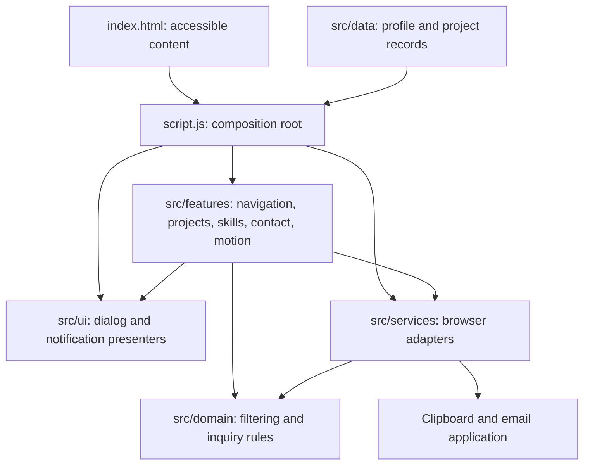

# Portfolio architecture

This is a static, browser-rendered application using native ES modules. A feature-based presentation layer sits above a small domain layer. Browser capabilities are adapters injected at the composition root. A backend, framework, or database is unnecessary for the current requirements: portfolio content, local filtering, dialogs, downloads, and an email draft. A dependency-free packaging step copies the browser files into `dist/` for static hosting.

## Responsibilities

| Location | Responsibility |
| --- | --- |
| `index.html` | Semantic, readable portfolio content and view hooks |
| `script.js` | Construct dependencies, initialize features, and coordinate lifecycle cleanup |
| `src/data/` | Profile configuration and CV-backed project records |
| `src/domain/` | Pure selection rules and inquiry validation/composition; no DOM or browser globals |
| `src/features/` | One controller per feature, scoped to its section or document responsibility |
| `src/ui/` | Project rendering and notifications; no project selection or delivery policy |
| `src/services/` | Concrete browser capabilities behind small contracts |
| `src/styles/` | Tokens, base rules, portfolio presentation, responsive rules, and print rules |
| `server.js` | Local static file delivery, confined to public entry points, `src/`, and `assets/` |
| `scripts/build.js`, `vercel.json` | Package browser files into `dist/` and configure Vercel to serve that static output |
| `tests/` | Domain edge cases and adapter substitution using the native Node test runner |

Skills use the accessible static markup as their single content source. The skills controller reads it once into plain records and passes those records to the pure filter. Project details live in `src/data/projects.js`; the static cards are curated summaries linked by `data-project-id`. No JavaScript-generated content is needed to read the main portfolio.

## Applying SOLID

| Principle | Concrete application |
| --- | --- |
| Single responsibility | Filtering rules, inquiry composition, dialog rendering, clipboard access, and contact interaction live in separate modules. |
| Open/closed | Add a project record and its HTML card without changing the projects controller. Add a skill group to HTML without changing filter rules. Switch the delivery or presenter adapter at the composition root. |
| Liskov substitution | Consumers require behavior contracts rather than concrete classes. A clipboard substitute must resolve on success and reject on failure; a delivery substitute must open a draft without claiming it was sent. Tests exercise these substitutes. No unnecessary inheritance hierarchy is introduced. |
| Interface segregation | Contact receives only `clipboard.copy(text)`, `delivery.open(draft)`, and `notifications.show(message)`. Projects receive only `presenter.open(project, trigger)`. |
| Dependency inversion | Feature policy imports pure domain rules and receives browser services/presenters through arguments. Only the composition root constructs concrete adapters. |

Contracts are documented with JSDoc and plain objects. This is JavaScript; interface compatibility is a documented contract plus tests, not compile-time enforcement.

## Lifecycle and accessibility

Each app instance owns an `AbortController` for event listeners. Feature initializers return cleanup functions when they own observers or media-query handlers. UI presenters expose cleanup for timers, dialog state, and scroll locking. `pagehide` disposes the instance; a back-forward cache restoration initializes it again without duplicate handlers.

Native dialogs provide focus trapping and Escape dismissal. Closing restores trigger focus. Filters use pressed state and live result announcements. Native details elements provide FAQs. Reduced-motion preferences are respected, including changes during a visit. Clipboard failure and invalid or whitespace-only inquiries produce recoverable feedback.

## Verification and extension

Run `npm run check` for JavaScript syntax, relative module resolution, and the no-browser-globals domain boundary. Run `npm test` for filtering, validation, Unicode and URL encoding, header newline handling, and replaceable adapter behavior. Browser checks cover responsive layout, menus, project dialogs, searches, form validation, and browser error logs.

To introduce actual form delivery later, add an adapter exposing `open(draft)` or deliberately revise the delivery contract to `send(inquiry)` and update the user-facing confirmation semantics. The current implementation only opens an email draft and never submits a message or sends data to an API.

Start with `npm start` and visit http://127.0.0.1:4173. ES modules must be served over HTTP; opening the file directly is not the supported interactive preview. For production, run `npm run build` and publish `dist/` through a static host. Vercel reads these settings from `vercel.json`. The development server is bound to localhost and is not a production backend.
